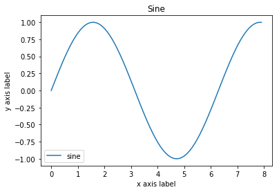

```python
##cs231n notes:Python Numpy Tutorial

#idctionary
d = {'cat':'cute','dog':'furry'}

#三种遍历方式
for k,v in d.items():
    print(k,v)
    
for i in d:
    print(i,d[i])

```

    cat cute
    dog furry
    cat cute
    dog furry


```python
#get(key[, default])¶
# Return the value for key if key is in the dictionary, else default. 
# If default is not given, it defaults to None, so that this method never raises a KeyError.

d['monkey'] = 'wet'
print(d.get('fish'))             # None
print(d)   #get 并不会让字典里面的key-value增加
print(d.get('monkey', 'N/A'))    # wet
del d['monkey']                       
print(d.get('monkey', 'N/A'))    # N/A
print(d)
```

    None
    {'cat': 'cute', 'dog': 'furry', 'monkey': 'wet'}
    wet
    N/A
    {'cat': 'cute', 'dog': 'furry'}


```python
# sorted(iterable,key,reverse)
# 其中iterable表示可以迭代的对象，例如可以是dict.items()、dict.keys()等，key是一个函数，用来选取参与比较的元素，
# reverse则是用来指定排序是倒序还是顺序，reverse=true则是倒序，reverse=false时则是顺序，默认时reverse=false。
# 根据value排序

a = [9,4,9,9,3,4,3,6,7,6,9]
d = {}
for i in a:
    d[i] = d.get(i,1)+1  #如果i第一次放进来，即不存在，则d.get()=1
sorted(d.items(),key=lambda item:item[1],reverse=False)
```


    [(7, 2), (4, 3), (3, 3), (6, 3), (9, 5)]


```python
# lambda 对简单函数的简洁表示
# map()函数接受两个参数，一个是函数，一个是iterable

a = [1,2,3]
b = map(lambda a:a+10,li)
# print(list(b))
print(map(str, [1, 2, 3, 4, 5, 6, 7, 8, 9]))

```

    <map object at 0x7f299876ff28>


```python
# reduce()函数
# 这个函数必须接收两个参数，reduce把结果继续和序列的下一个元素做累积计算

from functools import reduce
def add(x, y):
    return 10 * x + y
reduce(add, [1, 3, 5, 7, 9])
```


    13579


```python
# enumerate

animals = {'cat', 'dog', 'fish'}
for idx, animal in enumerate(animals):
    print('#%d: %s' % (idx + 1, animal))
```

    #1: dog
    #2: fish
    #3: cat


```python
# string

s = 'hello'
print(s.capitalize())
print(s.upper())           #转换为大写
print(s.rjust(7))
print(s.replace('l','(ell)'))
print(s.rjust(10).strip())    #Strip leading and trailing whitespace 去掉开头和结尾的空格
```

    Hello
    HELLO
      hello
    he(ell)(ell)o
    hello


```python
# numpy

import numpy as np
a = np.array([[1,2],[3,4],[5,6]])
print(a[[0,1,2],[0,1,1]])  #
# array([1, 4, 6]) 相当于a[0,0],a[1,1],a[2,1]
print([a[0,0],a[1,1],a[2,1]])
print(np.array([a[0,0],a[1,1],a[2,1]]))
```

    [1 4 6]
    [1, 4, 6]
    [1 4 6]


```python
#和MATLAB不同，*是元素逐个相乘，而不是矩阵乘法。
#在Numpy中使用dot来进行矩阵乘法

x = np.array([[1,2],[3,4]], dtype=np.float64)
y = np.array([[5,6],[7,8]], dtype=np.float64)
print(x * y)
print(np.multiply(x,y))
print(np.dot(x,y))

# 求和 sum

print(np.sum(x))  # 
print(np.sum(x, axis=0))  # 列
print(np.sum(x, axis=1))  # 行
```

    [[  5.  12.]
     [ 21.  32.]]
    [[  5.  12.]
     [ 21.  32.]]
    [[ 19.  22.]
     [ 43.  50.]]
    10.0
    [ 4.  6.]
    [ 3.  7.]


```python
# broadcasting

x = np.array([[1,2,3], [4,5,6], [7,8,9], [10, 11, 12]])
v = np.array([1, 0, 1])
y = x + v  # Add v to each row of x using broadcasting
print(y)  # Prints "[[ 2  2  4]
         #          [ 5  5  7]
         #          [ 8  8 10]
         #          [11 11 13]]"
            
x = np.arange(4)        # [0 1 2 3]
xx = x.reshape(4,1)     # np.array([[0],[1],[2],[3]])
y = np.ones(5)          # [ 1.  1.  1.  1.  1.]
yy = np.reshape(y,(1,5)) # [[ 1.  1.  1.  1.  1.]]
print(yy)
print(xx+y)    #boardcasting (4,1)+(5,)= (4,5)
print(xx+yy)   #boardcasting (4,1)+(1,5)= (4,5) 这两个结果是一样的
```

    [[ 2  2  4]
     [ 5  5  7]
     [ 8  8 10]
     [11 11 13]]
    [[ 1.  1.  1.  1.  1.]]
    [[ 1.  1.  1.  1.  1.]
     [ 2.  2.  2.  2.  2.]
     [ 3.  3.  3.  3.  3.]
     [ 4.  4.  4.  4.  4.]]
    [[ 1.  1.  1.  1.  1.]
     [ 2.  2.  2.  2.  2.]
     [ 3.  3.  3.  3.  3.]
     [ 4.  4.  4.  4.  4.]]


```python
# SciPy

from scipy.misc import imread, imsave, imresize

img = imread('/home/panxie/图片/aaa.jpg')
print(img.dtype,img.shape) # uint8 (1009, 1428, 3) 
                           # 像素：宽度1428,高度1009,通道：red，green and blue channels

img_tinted = img * [1,0.5,0.9]
img_tinted = imresize(img_tinted,(500,500))
imsave('/home/panxie/图片/bbb.jpg',img_tinted)

plt.subplot(1,2,1)
plt.imshow(img)
plt.subplot(1,2,2)
plt.imshow(np.uint8(img_tinted))
plt.show()
```

    uint8 (1009, 1428, 3)


```python
# distances

import numpy as np
from scipy.spatial.distance import pdist,squareform

x = np.array([[0,1],[1,0],[2,0]])
print(x)
d = pdist(x,'euclidean') #计算（2范数）欧几里德距离
#Computes the distance between m points using Euclidean distance (2-norm) as the distance metric between the points. The points are arranged as m n-dimensional row vectors in the matrix X.
print(d)
```

    [[0 1]
     [1 0]
     [2 0]]
    [ 1.41421356  2.23606798  1.        ]


```python
# plotting
import  matplotlib.pyplot as plt

x = np.arange(0, 8, 0.1)
y = np.sin(x)
plt.plot(x,y)
plt.xlabel('x axis label')
plt.ylabel('y axis label')
plt.title('Sine')
plt.legend(['sine'])
plt.show()
```





```python

```
